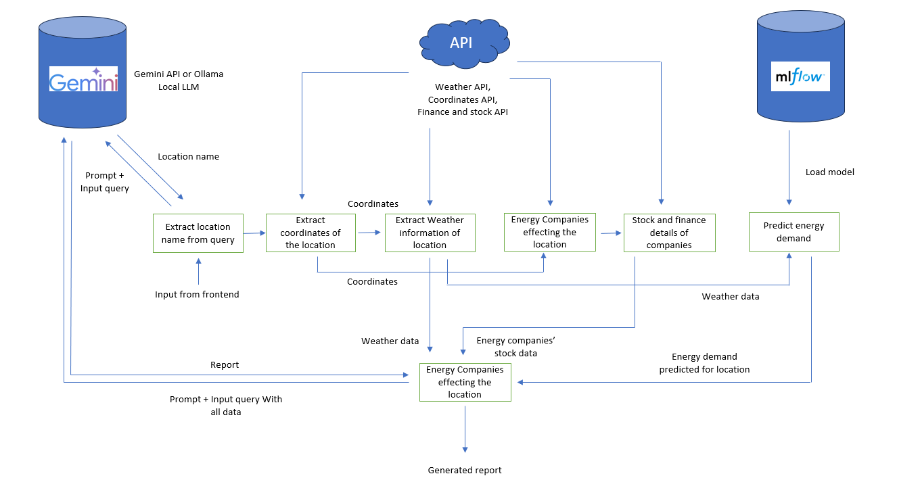

# Backend

This is the backend service that provides an API for predicting energy demand and interacting with a query agent. It uses FastAPI to expose endpoints for various operations, including energy demand prediction and querying an agent for specific information. 

## Project Structure

- **app.py**: Contains the FastAPI application setup, defines the API endpoints, and integrates with the RAG class to provide energy demand prediction and query handling.
- **rag.py**: Defines the RAG (Retrieval Augmented Generation) class that handles energy demand prediction and querying logic.
- **iso_company.json**: A configuration file used for the internal operations of the backend.
- **start.sh**: A shell script to initialize and start the backend server.
- **Dockerfile**: Contains the necessary instructions to build a Docker image for the backend service.
- **utils.py**: Utility functions used across the backend.
