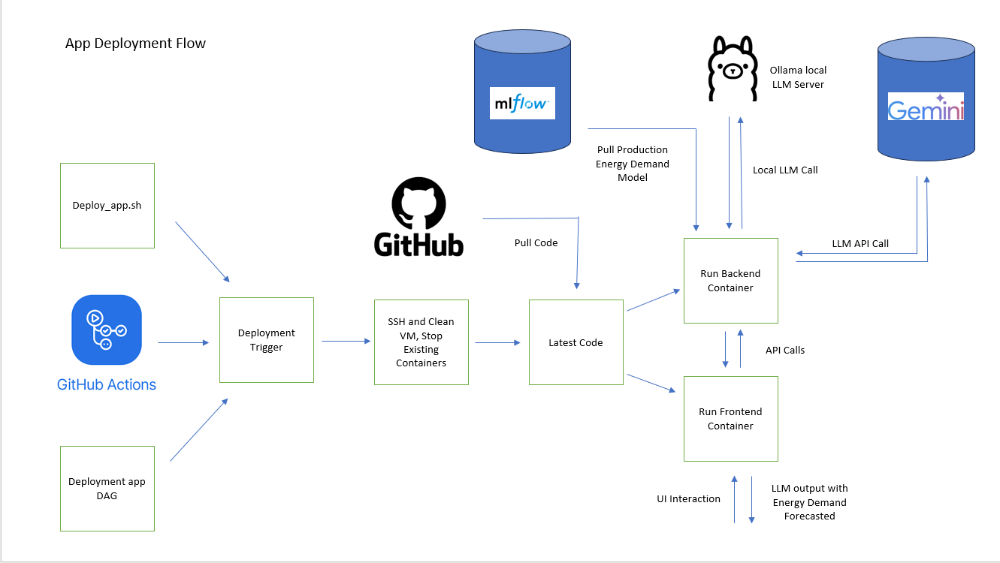
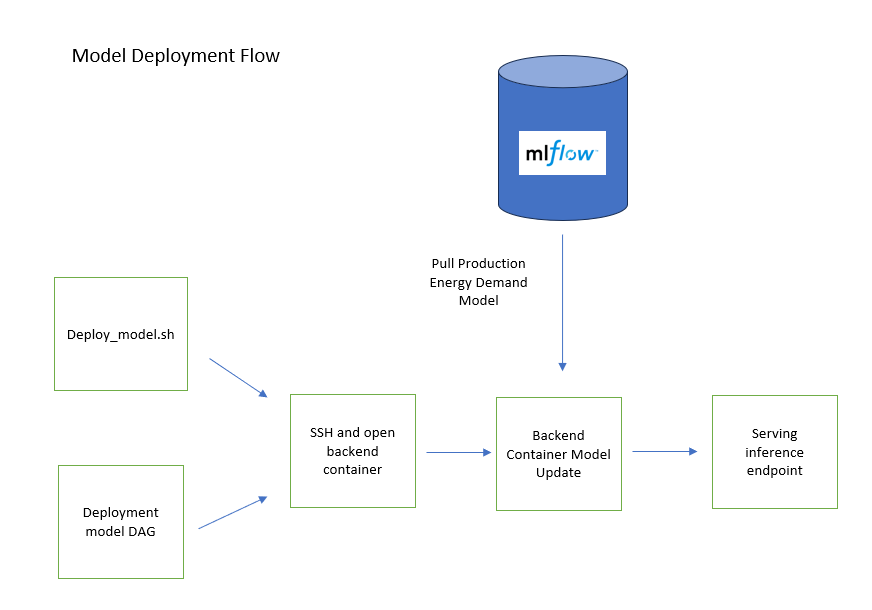
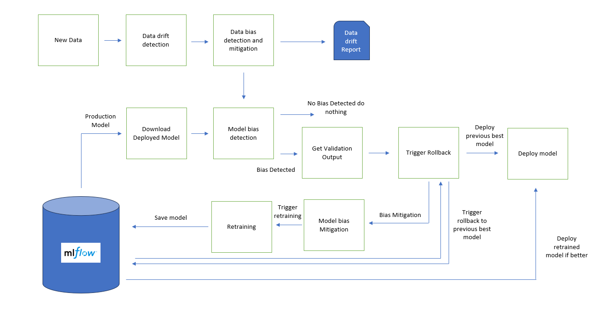

## Pipelines
Application deployment 


Model Deployment


Deployment Monitoring


--- 
- Setting up a remote VM with all required dependencies.
- Pulling the latest changes from a Git repository.
- Deploying backend and frontend Docker containers.
- Deploying machine learning models.
- Cleaning up Docker resources and the repository when required.

---

## Structure

- `config.json`: Stores configuration details like user credentials, VM IP, repository URL, Dockerfile paths, and scripts.
- `deploy_app.sh`: Automates the deployment of backend and frontend applications using Docker.
- `deploy_model.sh`: Handles model deployment inside a running Docker container.
- `remove.sh`: Cleans up all Docker resources, removes the repository, and optionally deletes Python virtual environments.
- `setup_vm.sh`: Installs necessary dependencies on the remote VM and updates the repository.

---

## Configuration

### `config.json`
This file contains all the configuration variables required for the deployment scripts. Update it with your details:

```json
{
    "USER": "your_username",
    "VM_IP": "your_vm_ip",
    "REMOTE_DIR": "/path/to/deployment",
    "REPO_URL": "https://github.com/your-repository.git",
    "REQUIREMENTS_FILE": "./path/to/requirements.txt",
    "PASSWORD": "your_password",
    "MODEL_SCRIPT": "./path/to/mlflow_model_registry.py",
    "BACKEND_SCRIPT": "./backend/app.py",
    "BACKEND_DOCKERFILE": "./backend/Dockerfile",
    "FRONTEND_DOCKERFILE": "./frontend/Dockerfile"
}
```

---

## Scripts

### 1. `deploy_app.sh`
Automates the deployment of backend and frontend services. It:
- Pulls the latest changes from the repository.
- Builds and runs Docker containers for the backend and frontend.
- Ensures proper cleanup of old Docker containers.

### 2. `deploy_model.sh`
Handles deploying the latest ML model:
- Identifies the backend container.
- Runs the model deployment script inside the container.

### 3. `remove.sh`
Cleans up the deployment environment:
- Stops and removes all Docker containers, images, and volumes.
- Deletes the repository directory from the remote VM.

### 4. `setup_vm.sh`
Sets up the remote VM by:
- Installing Docker, Python, Git, and other dependencies.
- Ensuring the repository is up-to-date.
- Running `setup.sh` if available in the repository.

---

## Usage

### 1. Setup the VM
Run the `setup_vm.sh` script to install dependencies and clone the repository:
```bash
./setup_vm.sh
```

### 2. Deploy the Application
Run the `deploy_app.sh` script to deploy backend and frontend services:
```bash
./deploy_app.sh
```

### 3. Deploy the Model
Run the `deploy_model.sh` script to deploy the ML model:
```bash
./deploy_model.sh
```

### 4. Remove the Deployment
Run the `remove.sh` script to clean up the deployment:
```bash
./remove.sh
```
